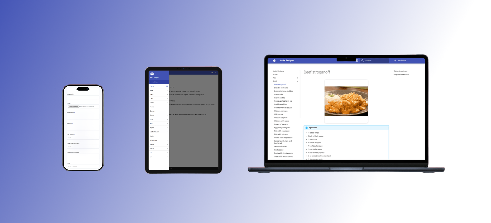

# Nati’s Recipes  
Repositório que centraliza e gera automaticamente um site de receitas organizado por país, usando MkDocs + automações n8n.




## Badges  
<p align="center">
  
  
  
  
</p>


## Tabela de Conteúdos
- [Nati’s Recipes](#natis-recipes)
  - [Badges](#badges)
  - [Tabela de Conteúdos](#tabela-de-conteúdos)
  - [Visão Geral](#visão-geral)
  - [Arquitetura](#arquitetura)
  - [Estrutura de Pastas](#estrutura-de-pastas)
  - [Instalação](#instalação)
    - [1. Clonar o repositório](#1-clonar-o-repositório)
    - [2. Instalar dependências](#2-instalar-dependências)
  - [Execução Local](#execução-local)
  - [Como Adicionar Receitas](#como-adicionar-receitas)
    - [Método Manual](#método-manual)
    - [Método Automático (n8n)](#método-automático-n8n)
  - [Fluxo n8n](#fluxo-n8n)
  - [Boas Práticas](#boas-práticas)
  - [Licença](#licença)
  - [Créditos](#créditos)


## Visão Geral  
Nati’s Recipes é um catálogo estático de receitas organizadas por país.  
O conteúdo é mantido em Markdown e o site é gerado com MkDocs + Material Theme.  
O deploy é automático: a cada push o host reinicia e reconstrói o projeto.


## Arquitetura  
- **MkDocs** para geração do site.  
- **Material for MkDocs** para o tema.  
- **Python LTS** para execução local.  
- **n8n** para automação da criação de receitas.  
- **Hospedagem automática**: push → rebuild → publicação.


## Estrutura de Pastas  

```
docs/
   BR/
      exemplo.md
   US/
      exemplo.md
   ...
n8n/
   workflow.json
app.py
mkdocs.yml
requirements.txt
discloud.config
```

**docs/** – todas as receitas, separadas por país  
**n8n/** – fluxos automáticos  
**app.py** – servidor simples 0.0.0.0:8080  
**mkdocs.yml** – tema, navegação e plugins  


## Instalação

### 1. Clonar o repositório  
```sh
git clone https://github.com/giovannipereiradev/natis-recipes.git
cd natis-recipes
```

### 2. Instalar dependências  
```sh
pip install -r requirements.txt
```


## Execução Local  
```sh
python app.py
```

O site estará acessível na porta **8080**.


## Como Adicionar Receitas

### Método Manual  
Crie um arquivo `.md` em:

`docs/<PAIS>/<slug-da-receita>.md`

Use o template padrão:

```markdown
# Nome da Receita


## Ingredientes
- item 1
- item 2

## Utensílios
- item

## Informações
- Custo:  
- Tempo de preparo:  
- Rendimento:  

## Modo de Preparo
1. Passo 1  
2. Passo 2
```


### Método Automático (n8n)  
- Preencha o formulário conectado ao fluxo.  
- O n8n gera automaticamente:
  - slug  
  - nome do arquivo  
  - template  
  - imagem  
  - posicionamento correto na pasta  

Fluxo completo disponível em `/n8n`.


## Fluxo n8n  
1. Normalização do título  
2. Criação do arquivo `.md`  
3. Geração da imagem (se enviada)  
4. Preenchimento do layout padrão  
5. Commit automático no repositório  


## Boas Práticas  
- Usar nomes de arquivos com slug (`minúsculas-e-com-hífens`).  
- Imagens otimizadas.  
- Sempre seguir o template oficial.  
- Manter a estrutura por país.  
- Evitar arquivos grandes no repositório.


## Licença  
Projeto sob licença **MIT**.


## Créditos  
https://github.giovannitavares.com

https://giovannitavares.com
