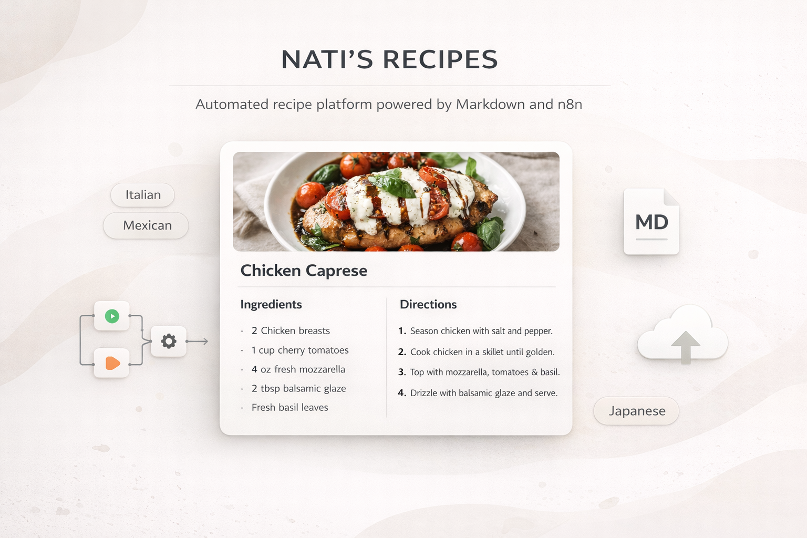

# Nati's Recipes

<div align="center">




</div>

[Para ler em Português, clique aqui!](./README.pt-BR.md)

## About

Nati's Recipes is a site I built to organize my girlfriend's (Natalia) recipes, sorted by country of origin. Content is written in Markdown and the site is generated with **MkDocs + Material Theme**, hosted on **Discloud** with automatic rebuild on every push. To make adding new recipes easier, there is a full automation workflow in **n8n**: just fill out a form and the flow normalizes the title, generates the slug, builds the `.md` file from the standard template, places it in the correct folder, and commits it to the repository automatically.

## Features

| Feature | Description |
|---|---|
| **Catalog by country** | Recipes organized in folders by origin (`brazil/`, `france/`, `fusion/`, etc.), with automatic navigation via the `awesome-pages` plugin. |
| **Standardized template** | Every recipe follows a consistent layout with image, ingredients (admonition), utensils, info and preparation steps. |
| **Custom theme** | Material Theme with a custom color palette, dark/light mode support and custom CSS for recipe images. |
| **Built-in search** | Search plugin with term suggestion and highlighting directly on the site. |
| **Form-based entry** | External form connected to n8n. No files need to be created manually. |
| **n8n automation** | Full workflow that receives the form submission, normalizes data, generates the slug, builds the `.md`, places the file and commits to the repository. |
| **Automatic deploy** | On every push, Discloud restarts the container, `app.py` runs `mkdocs build` and serves the static site via Flask on port 8080. |
| **Rebuild on boot** | The Flask server always runs `mkdocs build` on startup, ensuring the latest content is available with no manual step. |

## Architecture

`app.py` is the entry point: on startup it runs `mkdocs build` to generate the static site in the `site/` folder, then starts a Flask server that serves the generated files. Content lives in `docs/` organized by country and the `awesome-pages` plugin builds the sidebar navigation automatically from the folder structure. `mkdocs.yml` centralizes the theme, plugins, Markdown extensions and the n8n form URL exposed as the "Add Recipe" button in the site header.

## Tech Stack

- **[MkDocs](https://www.mkdocs.org/)** - static site generator from Markdown files; all navigation, search and build are managed by it.
- **[Material for MkDocs](https://squidfunk.github.io/mkdocs-material/)** - theme with customizable palette, dark/light mode, admonitions and advanced Markdown extensions.
- **[mkdocs-awesome-pages-plugin](https://github.com/lukasgeiter/mkdocs-awesome-pages-plugin)** - automatically generates the sidebar navigation from the folder structure, without listing pages in `mkdocs.yml`.
- **[Flask](https://flask.palletsprojects.com/)** - lightweight server that serves the static files generated by MkDocs and handles path routing in the Discloud environment.
- **[n8n](https://n8n.io/)** - automation platform that processes the recipe form, generates the files and commits them to the repository.
- **[Discloud](https://discloudbot.com/)** - Python container hosting with automatic restart on every push.

## Folder Structure

```
natis-recipes/
│
├── app.py                  # Entry point: MkDocs build + Flask server
├── mkdocs.yml              # Site config (theme, plugins, extensions)
├── requirements.txt        # Python dependencies
├── discloud.config         # Deploy config (Discloud)
│
├── n8n/
│   └── workflow.json       # Automation workflow for adding recipes
│
└── docs/
    ├── images/             # Recipe images
    ├── stylesheets/        # Custom CSS (theme and recipe images)
    │
    ├── brazil/             # Brazilian recipes
    ├── france/             # French recipes
    ├── fusion/             # Fusion / international recipes
    ├── asia/               # Asian recipes
    ├── cuba/               # Cuban recipes
    ├── germany/            # German recipes
    └── greece/             # Greek recipes
```

## How to Add Recipes

### Via form (main method)

Open the form available via the **"Add Recipe"** button in the site header or directly through n8n. The workflow handles everything automatically:

1. Title normalization and slug generation
2. Creation of the `.md` file from the standard template
3. Placement in the correct country folder
4. Image processing (if provided)
5. Automatic commit to the repository and deploy on Discloud

### Manually

Create a `.md` file at `docs/<country>/<recipe-slug>.md` following the template:

```markdown
{ .recipe-img }

!!! abstract "Ingredients"
    - item 1
    - item 2

!!! tip "Utensils"
    - item

!!! info "Info"
    **Cost:** $
    **Prep time:** X min
    **Servings:** X

## Preparation

1. Step 1
2. Step 2
```

## n8n Workflow

The workflow in `n8n/workflow.json` processes form submissions:

1. Receives form data (title, country, ingredients, preparation steps, image)
2. Normalizes the title and generates the slug (`lowercase-with-hyphens`)
3. Builds the Markdown content from the standard template
4. Places the file in the correct folder inside `docs/`
5. Commits and pushes to the repository, and Discloud detects the push and rebuilds the site

## License

Distributed under a custom non-commercial license. You are free to use, copy and modify this project for personal and non-commercial purposes, as long as you credit the original author. See the [LICENSE](LICENSE) file for full details.

<div align="center">
  Built by <a href="https://giovannitavares.com">Giovanni Tavares</a>
</div>
