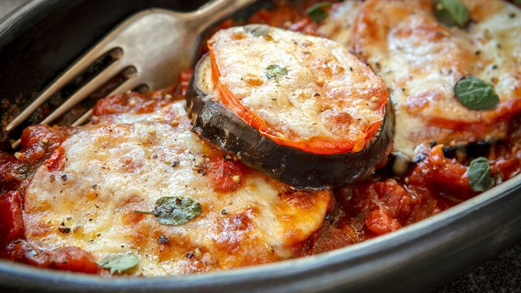

{ .recipe-img }

!!! abstract "Ingredientes"
    - 2 berinjelas  
    - 400 g de mussarela fatiada  
    - 300 ml de molho de tomate  
    - 1 ovo batido  
    - Farinha de rosca e farinha de trigo para empanar  

!!! tip "Utensílios"
    - Faca e tábua de corte  
    - Frigideira  
    - Pratos para empanar  
    - Refratário  
    - Forno  

!!! info "Informações"
    **Custo:** $  
    **Tempo de preparo:** 30 minutos  
    **Rendimento:** 4 porções  

## Modo de Preparo

1. Corte as berinjelas em fatias no sentido do comprimento e salpique sal.  
2. Passe as fatias na farinha de trigo, depois no ovo e por fim na farinha de rosca.  
3. Frite em óleo bem quente até dourar e reserve.  
4. Em um refratário, espalhe um pouco de molho de tomate no fundo e disponha as fatias de berinjela frita.  
5. Cubra com o queijo mussarela e leve ao forno até derreter.  
6. Sirva em seguida.  