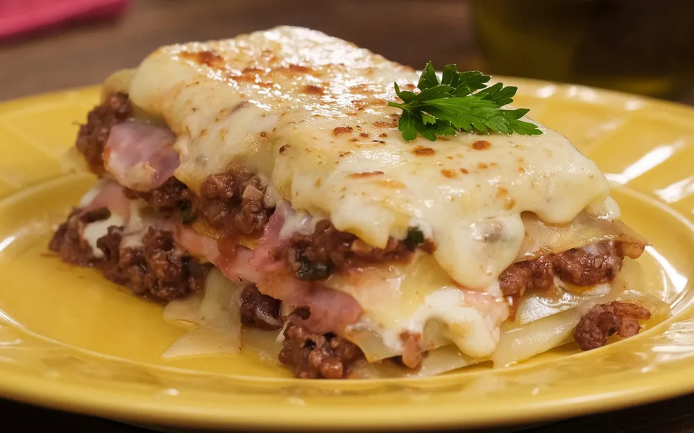

{ .recipe-img }

!!! abstract "Ingredients"
    **Bolognese Sauce:**  
    - 500g ground beef  
    - 1 tbsp oil  
    - 3 cloves garlic, chopped  
    - ½ onion, chopped  
    - 1 can tomato sauce  
    - Parsley, to taste  

    **Bechamel Sauce:**  
    - 2 tbsp butter  
    - Nutmeg, to taste  
    - 2 cups milk  
    - 3 tbsp wheat flour  
    - 2 boxes heavy cream  

    **Lasagna:**  
    - 500g lasagna noodles  
    - Ham, to taste  
    - Mozzarella cheese, to taste  
    - Grated cheese or parmesan, to taste  

!!! tip "Utensils"
    - Large pot  
    - Two saucepans  
    - Baking dish  
    - Knife and chopping board  
    - Wooden spoon  

!!! info "Information"
    **Cost:** $$$  
    **Preparation time:** 1 hour  
    **Yield:** 8 servings (300g each)  

## Preparation Method

### Bolognese Sauce
1. In a pan, heat the oil, add the garlic, onion, and ground beef. Sauté until browned.  
2. Add the tomato sauce and parsley. Cook for 5 minutes and set aside.  

### Bechamel Sauce
1. In another pan, melt the butter.  
2. Add nutmeg and milk.  
3. Remove from heat and add the flour, stirring until dissolved.  
4. Return to low heat, add a pinch of salt, and cook until thickened, stirring constantly.  
5. Add the heavy cream, mix well, and set aside.  

### Assembly
1. Cook the lasagna noodles in boiling water until al dente. Grease with butter to prevent sticking and set aside.  
2. In a baking dish, spread a layer of Bolognese sauce.  
3. Place a layer of lasagna noodles, then ham, mozzarella, and bechamel sauce.  
4. Repeat the layers until the ingredients are finished.  
5. Top with grated cheese.  
6. Bake at 180°C (350°F) for 20 minutes. Serve hot.  
