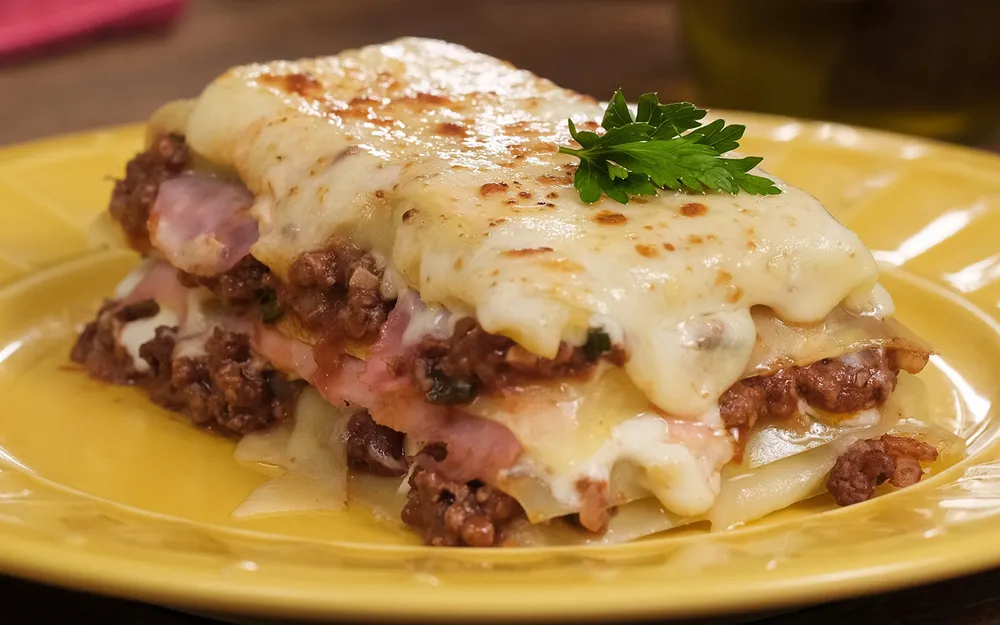

{ .recipe-img }

!!! abstract "Ingredientes"
    **Molho à Bolonhesa**
    - 500 g de carne moída  
    - 1 fio de óleo  
    - 3 dentes de alho picados  
    - ½ cebola picada  
    - 1 lata de molho de tomate  
    - Cheiro-verde a gosto  

    **Molho Branco**
    - 2 colheres (sopa) de manteiga  
    - Noz-moscada a gosto  
    - 2 xícaras (chá) de leite  
    - 3 colheres (sopa) de farinha de trigo  
    - 2 caixas de creme de leite  

    **Lasanha**
    - 500 g de massa de lasanha  
    - Presunto a gosto  
    - Queijo muçarela a gosto  
    - Queijo ralado ou parmesão a gosto  

!!! tip "Utensílios"
    - Panelas médias  
    - Travessa refratária  
    - Colher de pau  
    - Forno  

!!! info "Informações"
    **Custo:** $$  
    **Tempo de preparo:** 1 hora  
    **Rendimento:** 6 porções  

## Modo de Preparo

### Molho à Bolonhesa
1. Em uma panela, aqueça o óleo e refogue o alho e a cebola.  
2. Acrescente a carne moída e refogue até dourar.  
3. Adicione o molho de tomate e o cheiro-verde. Cozinhe por 5 minutos e reserve.  

### Molho Branco
1. Em uma panela, derreta a manteiga.  
2. Adicione noz-moscada e o leite. Misture bem.  
3. Fora do fogo, adicione a farinha e misture até dissolver completamente.  
4. Retorne ao fogo baixo, acrescente sal e mexa até engrossar.  
5. Adicione o creme de leite e reserve.  

### Montagem
1. Cozinhe a massa da lasanha até ficar al dente. Passe manteiga nas fatias para não grudar.  
2. Em uma travessa, monte alternando camadas de molho à bolonhesa, massa, presunto, queijo muçarela e molho branco.  
3. Repita as camadas e finalize com queijo ralado.  
4. Leve ao forno preaquecido a 180 °C por cerca de 20 minutos.  