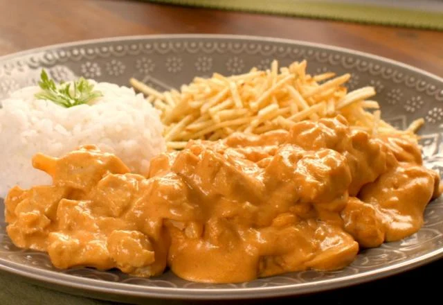

{ .recipe-img }

!!! abstract "Ingredientes"
    - 500 g de carne em tiras finas  
    - 1 pitada de pimenta-do-reino  
    - 3 colheres (sopa) de manteiga  
    - ½ cebola picada  
    - 1 tablete de MAGGI® Caldo Carne  
    - 4 colheres (sopa) de água fervente  
    - ½ xícara (chá) de conhaque  
    - 200 g de champignons em conserva fatiados  
    - 3 colheres (sopa) de purê de tomate  
    - 1 colher (sopa) de mostarda  
    - 2 colheres (sopa) de ketchup  
    - 1 lata de NESTLÉ® Creme de Leite  

!!! tip "Utensílios"
    - Frigideira grande  
    - Espátula ou colher de madeira  
    - Recipientes para reserva da carne  
    - Fósforo (para flambar)  

!!! info "Informações"
    **Custo:** $$  
    **Tempo de preparo:** 45 minutos  
    **Rendimento:** 4 porções  

## Modo de Preparo

1. Tempere as tiras de carne com pimenta-do-reino e deixe descansar por alguns minutos.  
2. Aqueça uma frigideira com 1 colher (sopa) de manteiga e doure pequenas porções de carne até selar bem. Reserve.  
3. Repita o processo até dourar toda a carne, sempre evitando sobreposição.  
4. Na mesma frigideira, derreta o restante da manteiga e refogue a cebola, raspando o fundo para soltar os resíduos da carne.  
5. Retorne a carne à frigideira e adicione o MAGGI® Caldo dissolvido na água fervente. Cozinhe até reduzir o líquido.  
6. Acrescente o conhaque e flambe com cuidado, inclinando a frigideira para a chama ou acendendo com fósforo. Aguarde as chamas se apagarem.  
7. Junte os champignons, tampe e cozinhe em fogo baixo por alguns minutos até amaciarem.  
8. Adicione o purê de tomate, a mostarda e o ketchup. Misture, tampe e cozinhe por mais 5 minutos.  
9. Finalize com o NESTLÉ® Creme de Leite, mexendo bem. Aqueça sem ferver.  
10. Sirva imediatamente com arroz branco e batata palha.  