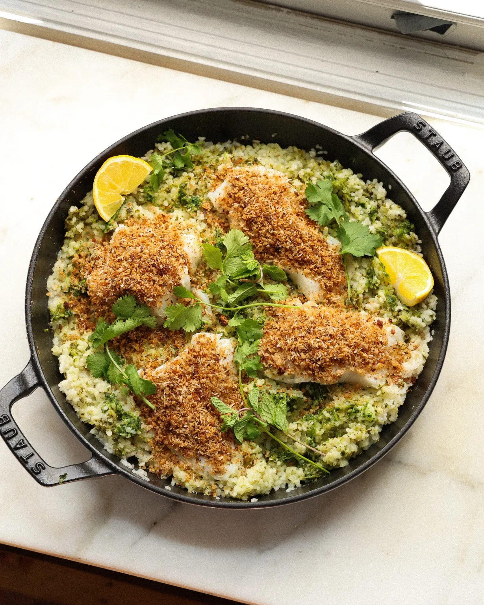

{ .recipe-img }

!!! abstract "Ingredients"
    - 1 tsp cumin seeds  
    - 1 tsp ground coriander  
    - 1.5 oz sourdough breadcrumbs (about 2 slices or ¾ cup)  
    - ¼ cup shredded coconut (21 g)  
    - Diamond Crystal kosher salt  
    - Freshly ground black pepper  
    - Extra-virgin olive oil  
    - 1 ½ cups white rice (283 g)  
    - 1 can (13.5 oz / 382 g) coconut milk  
    - 1 ¾ cups water (420 g)  
    - 3 cups cilantro (85 g), plus more for garnish  
    - 2 small jalapeños (42 g)  
    - 3 garlic cloves  
    - 1 lemon (juice + wedges for serving)  
    - 1 ½ lbs cod or other white fish  

!!! tip "Utensils"
    - Food processor or blender  
    - Large skillet with lid  
    - Mixing bowls  
    - Knife and chopping board  
    - Wooden spoon  

!!! info "Information"
    **Cost:** $$$  
    **Preparation time:** 50 minutes  
    **Yield:** 4 servings (300g each)  

## Preparation Method

1. In a food processor, pulse the cumin seeds, ground coriander, and sourdough breadcrumbs until fine.  
2. Heat 2 tbsp olive oil in a large skillet over medium heat. Add breadcrumbs, season with ½ tsp salt, and cook 3–4 minutes. Stir in shredded coconut and cook 2–3 minutes until golden. Transfer to a bowl and wipe out the skillet.  
3. To the skillet, add coconut milk, rinsed rice, and water. Stir, bring to a simmer, then reduce heat to low. Cover and cook 20–30 minutes until creamy.  
4. In a blender, combine cilantro, jalapeños (seeds removed), garlic, and lemon juice. Blend into a chunky green sauce, thinning with water if necessary. Season with salt.  
5. Portion the cod into 4 pieces, seasoning both sides with salt and pepper.  
6. When the rice thickens, stir in half the green sauce. Nestle cod pieces on top of the rice, cover, and steam 10–12 minutes until opaque.  
7. Stir the remaining green sauce into the rice. Scatter toasted breadcrumbs over the cod.  
8. Garnish with extra cilantro and serve with lemon wedges.  