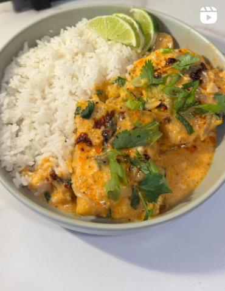

{ .recipe-img }

!!! abstract "Ingredients"
    - 4–6 pieces of cod  
    - 1 tbsp oil (any kind)  
    - 1 shallot  
    - 3 cloves garlic  
    - 6 slices of ginger  
    - 1–2 tbsp red curry paste  
    - 1 can coconut milk  
    - 1 ½ tsp lime zest  
    - 1 tsp sugar  
    - ¾ tsp salt  
    - ½ tsp pepper  
    - For topping: green onion, cilantro, chili oil (optional), and fresh lime  

!!! tip "Utensils"
    - Frying pan with lid  
    - Knife and chopping board  
    - Grater (for lime zest)  
    - Wooden spoon  

!!! info "Information"
    **Cost:** $$  
    **Preparation time:** 25 minutes  
    **Yield:** 4 servings (200g each)  

## Preparation Method

1. If using frozen cod, place it in a bowl of cold water for 20 minutes (still in the individual vacuum sealed bags).  
2. Thinly slice the shallot, mince the garlic, and slice the ginger (peel optional, just wash well). Zest the lime.  
3. In a pan over medium-low heat, add oil, then sauté the shallot, garlic, and ginger for 3–5 minutes. Add the red curry paste and mix well.  
4. Stir in the coconut milk, lime zest, sugar, salt, and pepper. Let it come to a simmer. Add the cod and spoon the sauce over the fish. Cover and cook for 12 minutes on medium-low heat.  
5. Spoon more sauce over the fish before serving. Top with green onion, cilantro, chili oil, and fresh lime.  