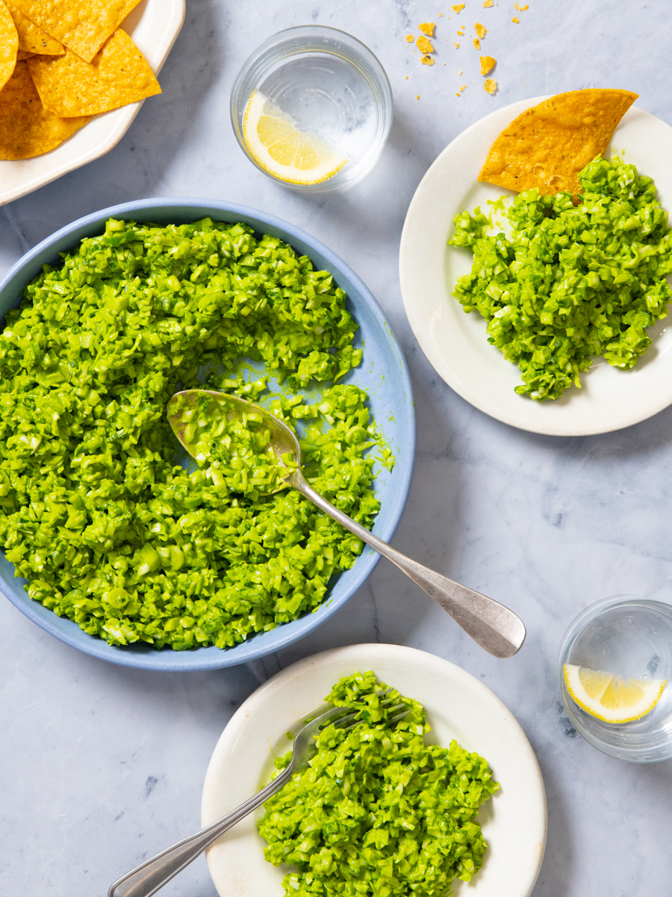

{ .recipe-img }

!!! abstract "Ingredients"
    **For the Salad:**  
    - 1 small head green cabbage  
    - 3–4 baby cucumbers (or 1 large cucumber)  
    - ¼ cup chives  
    - 1 bunch green onions (scallions)  

    **For the Dressing:**  
    - 1 cup basil leaves  
    - 1 cup fresh spinach  
    - 2 garlic cloves  
    - 1 small shallot  
    - Juice of 2 lemons  
    - ¼ cup olive oil  
    - ¼ cup nuts of choice (cashews, walnuts, or similar)  
    - ⅓ cup nutritional yeast  
    - 1 tsp salt  
    - 2 tbsp rice vinegar  
    - Extra chives, optional  

!!! tip "Utensils"
    - Sharp knife  
    - Large mixing bowl  
    - Blender or food processor  
    - Measuring cups and spoons  

!!! info "Information"
    - Cost: $$  
    - Prep time: ~25 minutes  
    - Yield: 4 servings (≈250 g each)  

## Preparation Method

1. Wash and chop the cabbage, cucumbers, chives, and green onions finely (confetti-sized recommended). Place in a large bowl.  
2. Add olive oil, lemon juice, and rice vinegar to a blender.  
3. Add basil, spinach, garlic, shallot, nuts, nutritional yeast, salt, and extra chives (if using).  
4. Blend until the dressing is thick yet pourable.  
5. Pour dressing over chopped salad ingredients and mix well.  
6. Serve immediately or refrigerate until ready to enjoy.  