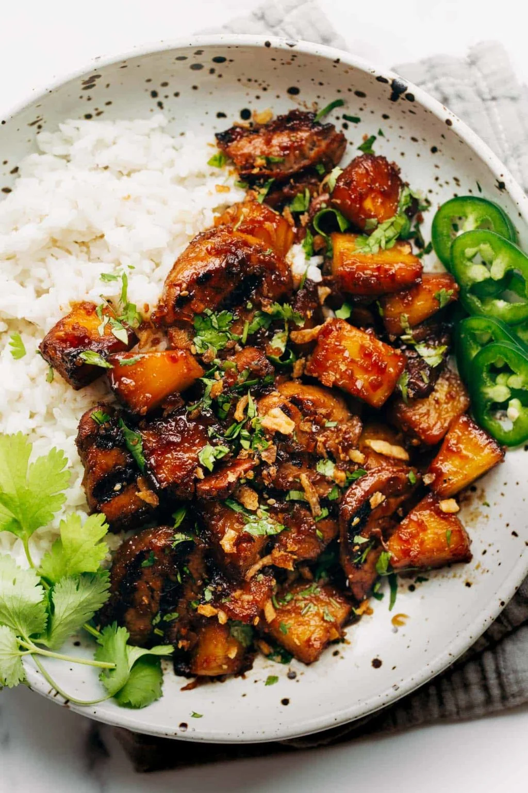

{ .recipe-img }

!!! abstract "Ingredients"
    **Pork:**  
    - ¼ to ½ cup teriyaki sauce  
    - 1 lb thinly sliced pork tenderloin (stir-fry cut)  
    - 1–2 cups fresh pineapple chunks  
    - Olive oil, for sautéing  

    **Rice:**  
    - 1 can (14 oz) full-fat coconut milk  
    - 1 ½ cups water  
    - 2 cups jasmine rice  

    **Toppings:**  
    - Lime zest  
    - Cilantro  
    - Thinly sliced jalapeño  
    - Crunchy onions  

!!! tip "Utensils"
    - Instant Pot or rice cooker  
    - Non-stick skillet or grill pan  
    - Mixing bowls  
    - Knife and chopping board  

!!! info "Information"
    **Cost:** $$  
    **Preparation time:** 40 minutes (+ 2–3 hours marinating)  
    **Yield:** 4 servings (300g each)  

## Preparation Method

1. **Prep:** Marinate the pork with ¼ cup teriyaki sauce for 2–3 hours or up to a full day.  
2. **Rice:** Combine coconut milk, water, and jasmine rice in an Instant Pot. Cook on high pressure for 3 minutes, then let naturally release for 10–15 minutes. Fluff with a fork and season with a little salt.  
3. **Cook Pork:** Heat 1 tbsp olive oil in a skillet over medium-high heat. Add the pork only (discard excess marinade) and cook undisturbed for a few minutes to caramelize. Add pineapple chunks and sauté until caramelized. Stir in a few more tbsp of teriyaki sauce once browned.  
4. **Serve:** Plate the coconut rice, top with saucy pineapple pork, and garnish with lime zest, cilantro, jalapeño slices, and crunchy onions.  
