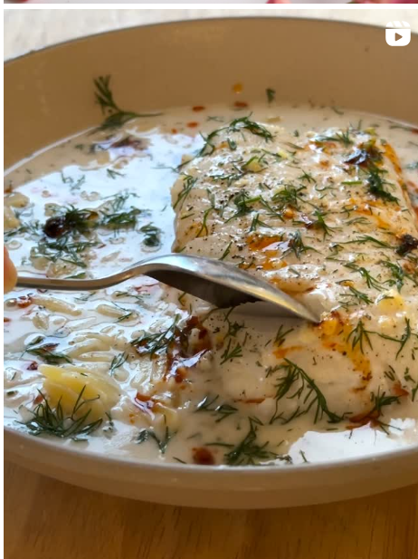

{ .recipe-img }

!!! abstract "Ingredients"
    - 2 cod fillets  
    - 1–2 tbsp olive oil  
    - 1 can (14 oz) unsweetened coconut milk  
    - 4 garlic cloves, smashed  
    - 1 tsp grated ginger  
    - 3 tbsp fresh dill, finely chopped  
    - 1 lemon (half sliced, half for squeezing)  
    - Chili garlic oil, for garnish  
    - Kosher salt and black pepper, to taste  

!!! tip "Utensils"
    - Medium pot or saucepan (with tall sides)  
    - Knife and chopping board  
    - Wooden spoon  
    - Paper towels  

!!! info "Information"
    **Cost:** $$  
    **Preparation time:** 30 minutes  
    **Yield:** 2 servings (250g each)  

## Preparation Method

1. Pat cod fillets dry with paper towels. Season both sides with salt and black pepper. Remove skin if desired.  
2. Heat olive oil in a medium pot over medium heat. Add garlic and ginger, sauté until fragrant and lightly browned.  
3. Place 4 slices of lemon at the base of the pan. Lay cod fillets on top of the lemon slices.  
4. Pour in coconut milk, add dill, salt, and pepper. Stir gently to combine flavors. Bring to a gentle simmer.  
5. Simmer cod for 8–10 minutes, until opaque and flaky. Baste with coconut milk if fillets aren’t fully submerged.  
6. Adjust seasoning as needed. Squeeze fresh lemon juice over the cod before serving.  
7. Serve over rice or orzo, ladling coconut milk broth on top. Garnish with extra dill and chili garlic oil.  
