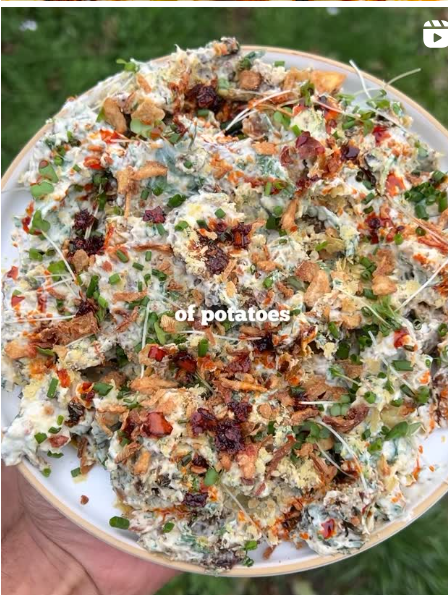

{ .recipe-img }

!!! abstract "Ingredients"
    - 1 to 1 ¼ lbs baby potatoes  
    - 1 to 1 ⅓ lbs brussel sprouts  
    - 1 tsp dried basil, oregano, or thyme  
    - 1 tsp garlic powder + onion powder  
    - ½ tsp smoked paprika  
    - ¼ tsp white pepper  
    - 2 tbsp nutritional yeast (optional)  
    - Olive oil, salt, and black pepper  
    - Few tbsp vegan mayo  
    - Few tbsp vegan yogurt  
    - Juice of ½ lemon  
    - Fresh parsley, chopped  
    - Fresh chives, chopped  
    - Crispy onions (for topping)  

!!! tip "Utensils"
    - Large pot  
    - Steamer basket or second pot  
    - Baking tray lined with parchment paper  
    - Knife and chopping board  
    - Mixing bowl  

!!! info "Information"
    **Cost:** $$  
    **Preparation time:** 50 minutes  
    **Yield:** 6 servings (8 oz each)  

## Preparation Method

1. Wash and prepare the brussel sprouts and potatoes. Place the potatoes in a pot with cold water, bring to a boil, and cook for 25–30 minutes until tender.  
2. Steam the brussel sprouts until cooked through. If boiled, let them air-dry before use.  
3. Smash the sprouts and potatoes with the bottom of a cup (lined with baking paper) on a tray. Season with olive oil, salt, dried herbs, garlic + onion powder, paprika, and white pepper. Roast at 200°C (400°F) until crispy.  
4. In a mixing bowl, prepare the dressing by combining vegan mayo, vegan yogurt, lemon juice, parsley, and chives.  
5. Add the roasted vegetables to the bowl, toss to coat, and garnish with crispy onions.  
6. Serve warm or at room temperature.  