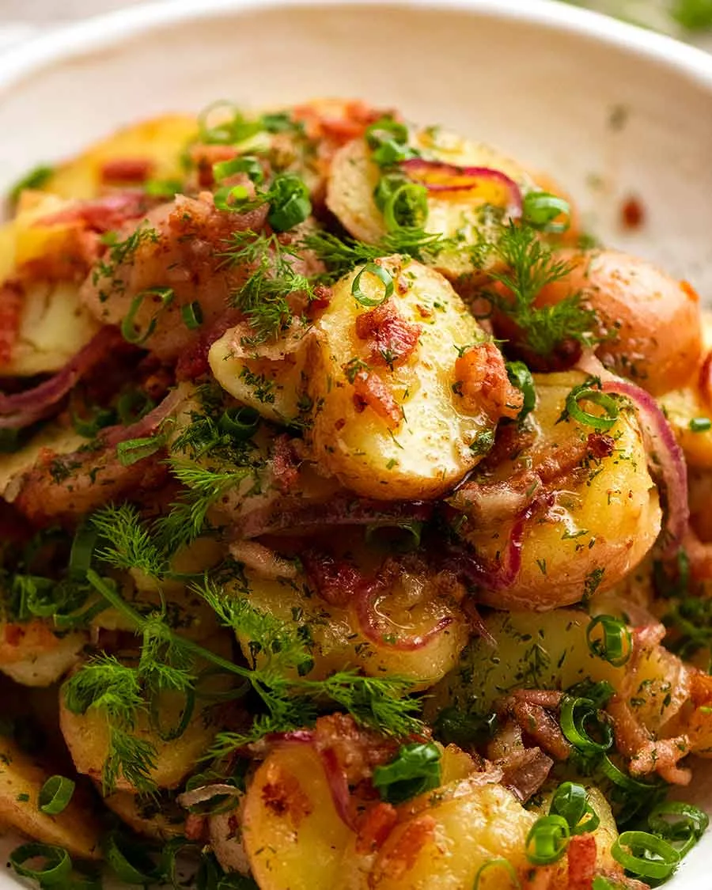

{ .recipe-img }

!!! abstract "Ingredients"
    - 1 kg (2 lb) baby red potatoes or other small waxy potatoes  
    - 2 tsp salt  
    - 100g (3 oz) streaky bacon, chopped into small lardons  
    - ¼ red onion, sliced  
    - ¼ cup canola oil (or grapeseed oil)  
    - ⅓ cup apple cider vinegar  
    - 2 tbsp white sugar  
    - 2 green onions, finely sliced  
    - 3 tbsp fresh dill, finely chopped (or parsley as substitute)  

!!! tip "Utensils"
    - Large pot  
    - Non-stick or cast-iron skillet  
    - Knife and chopping board  
    - Wooden spoon  
    - Serving platter or bowl  

!!! info "Information"
    **Cost:** $$  
    **Preparation time:** 40 minutes  
    **Yield:** 6 servings (250g each)  

## Preparation Method

1. **Boil potatoes:** Place the baby potatoes in a large pot of cold water with the salt. Bring to the boil, then reduce heat. Simmer for 10 minutes or until just cooked through but still slightly firm in the centre. Drain and let cool slightly, then slice into 0.7cm (¼") rounds.  
2. **Cook bacon:** Place bacon in a large, unheated skillet. Turn the heat to medium, allowing the fat to render. Increase to medium-high and cook until bacon starts to turn golden (about 3 minutes).  
3. **Cook onion:** Reduce heat to medium. Add the red onion slices and cook for 3 minutes, until softened.  
4. **Add vinegar and sugar:** Pour in the cider vinegar and sugar, bring to a simmer, scraping the pan to dissolve browned bits.  
5. **Add oil:** Stir in the oil and simmer for 2 minutes. This is your dressing.  
6. **Toss potatoes:** Add the sliced potatoes and gently toss for 1 minute, until coated and slightly absorbent of the dressing. Taste and adjust salt if necessary.  
7. **Assemble salad:** Layer the potatoes on a platter, sprinkling each layer with green onions and dill until all ingredients are used.  
8. **Serve:** Enjoy warm or at room temperature.  
