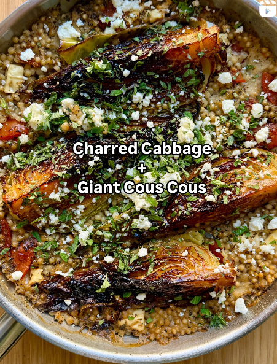

{ .recipe-img }

!!! abstract "Ingredients"
    - 1 Hispi (or white) cabbage, quartered  
    - 100 g feta, crumbled (plant-based alternatives optional)  
    - 2 large tomatoes, chopped  
    - 4 tbsp extra virgin olive oil  
    - 2 garlic cloves, grated  
    - 2 tbsp dried oregano  
    - 2 slices old bread, cubed  
    - 3 tsp cayenne pepper  
    - 225 g giant cous cous or orzo  
    - 500 ml boiling vegetable stock  
    - Fresh oregano, to serve  
    - Fresh parsley, to serve  

!!! tip "Utensils"
    - Large ovenproof frying pan  
    - Knife and chopping board  
    - Wooden spoon  
    - Mixing bowl  

!!! info "Information"
    **Cost:** $$  
    **Preparation time:** 40 minutes  
    **Yield:** 4 servings (250g each)  

## Preparation Method

1. **Char the cabbage:** Preheat oven to 200°C (390°F). Heat 2 tbsp olive oil in a large ovenproof frying pan over high heat. Season cabbage wedges with cayenne, salt, and pepper. Cook 2–3 minutes on each cut side until charred. Remove and set aside.  
2. **Bake couscous:** In the same pan, add tomatoes, garlic, oregano, bread, giant cous cous, and vegetable stock. Bring to a boil, then transfer to the oven. Bake for 15–20 minutes until cabbage and cous cous are tender and edges are crisping.  
3. **Serve:** Top with crumbled feta, fresh oregano, and parsley. Serve hot.  
