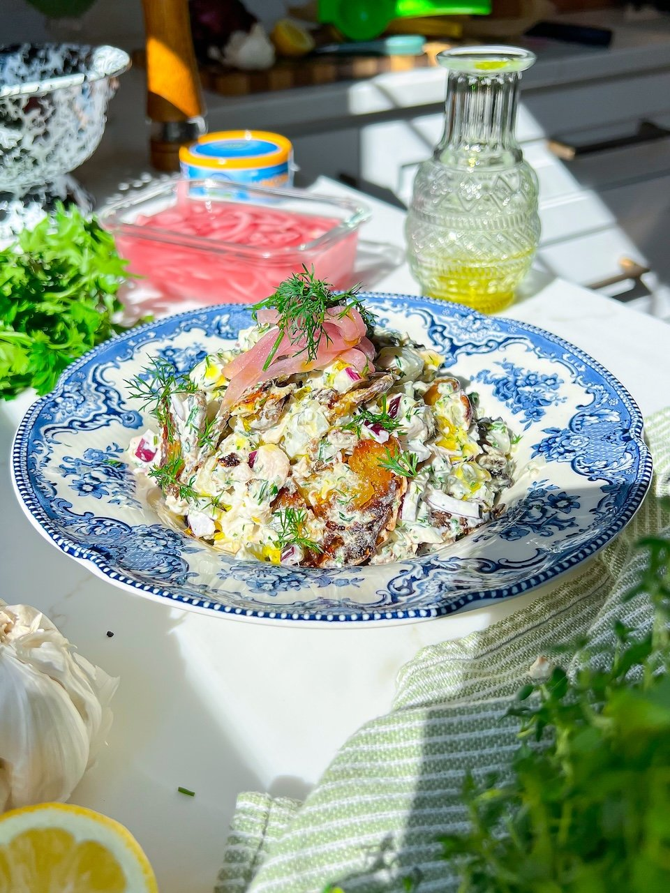

{ .recipe-img }

!!! abstract "Ingredients"
    - 1 lb baby yellow potatoes  
    - 3–4 tbsp olive oil  
    - 1–2 cans albacore tuna (drained)  
    - ½ cup plain Greek yogurt  
    - ¼ cup mayonnaise  
    - 1 tbsp Dijon mustard  
    - Juice of 1 lemon  
    - 2 garlic cloves, minced  
    - ½ cup pickles, finely chopped  
    - ½ red onion, finely chopped  
    - 2 tbsp fresh chives, chopped  
    - ¼ cup fresh dill, chopped  
    - 1 tsp apple cider vinegar  
    - Salt and black pepper, to taste  
    - 6 oz crumbled feta  

!!! tip "Utensils"
    - Large pot  
    - Baking sheet lined with parchment paper  
    - Glass cup or jar (for smashing potatoes)  
    - Mixing bowl  
    - Wooden spoon  

!!! info "Information"
    **Cost:** $$  
    **Preparation time:** 50 minutes  
    **Yield:** 6 servings (250g each)  

## Preparation Method

1. Preheat oven to 425°F (220°C). Line a baking pan with parchment paper.  
2. Bring a large pot of salted water to a boil. Add the potatoes and cook ~10 minutes until fork-tender. Drain and transfer to the baking pan.  
3. Slice larger potatoes in half. Smash each potato with the bottom of a glass or jar. Use a fork if needed to release.  
4. Drizzle with olive oil and season with salt. Roast 15–20 minutes until golden and crispy.  
5. In a large bowl, mix tuna, Greek yogurt, mayonnaise, Dijon mustard, lemon juice, garlic, pickles, red onion, chives, dill, apple cider vinegar, and feta. Season with salt and black pepper.  
6. Fold in the crispy potatoes. Toss gently to coat. Serve warm or at room temperature.  