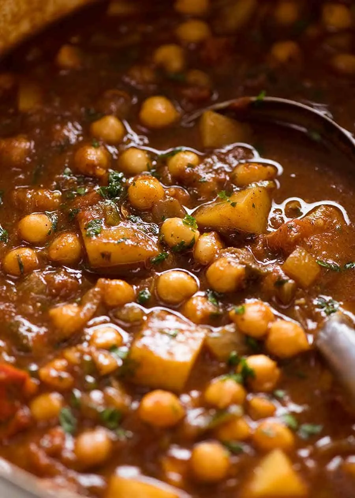

{ .recipe-img }

!!! abstract "Ingredients"
    **Spice Mix:**  
    - 2 tbsp curry powder  
    - 1 tsp allspice powder  
    - 1 tsp nutmeg powder (or ½ tsp freshly grated)  
    - 1½ tsp smoked paprika (or sweet/normal)  
    - 2 tsp dried thyme (or 3 tsp fresh)  
    - 1 tsp cumin powder  
    - ¾ tsp cayenne pepper  
    - 1 tsp white pepper (or ½ tsp black pepper)  

    **Curry:**  
    - 3 tbsp cooking oil (vegetable recommended)  
    - 2 garlic cloves, minced  
    - 1 large onion, diced  
    - 1½ cups potatoes, cubed (about 1 large potato, peeled)  
    - 28 oz / 800 g canned chickpeas (2 × 14 oz / 400 g cans), drained  
    - 14 oz / 400 g canned crushed tomatoes  
    - 2 cups vegetable or chicken broth (low sodium)  
    - 1 tsp kosher/cooking salt (halve if table salt)  
    - 2 scallions (green & white parts), sliced  
    - 2 tbsp fresh parsley, finely chopped (or coriander/cilantro)  

    **Serving (optional):**  
    - Fresh coriander/cilantro leaves  
    - Dollop of yogurt  
    - Basmati or white rice (or coconut rice)  
    - Flatbreads  

!!! tip "Utensils"
    - Large pot or deep skillet  
    - Wooden spoon  
    - Knife and cutting board  
    - Measuring cups and spoons  

!!! info "Information"
    - Cost: $$  
    - Prep & cook time: ~40 minutes  
    - Yield: 6 servings (≈300 g each)  

## Preparation Method

1. Heat oil in a large pot over medium-high heat. Add onion and garlic; cook for 3 minutes until softened.  
2. Stir in the spice mix and cook for 1 minute until fragrant.  
3. Add potatoes, stirring to coat with spices. If sticking, add a splash of water.  
4. Add chickpeas, tomatoes, broth, and salt. Bring to a simmer, then reduce heat to medium. Cook for 15 minutes, until potatoes are tender and sauce thickens.  
5. Taste and adjust salt. Stir in scallions and parsley.  
6. Serve hot with rice, yogurt, and fresh coriander/cilantro. Flatbreads make a great addition.  