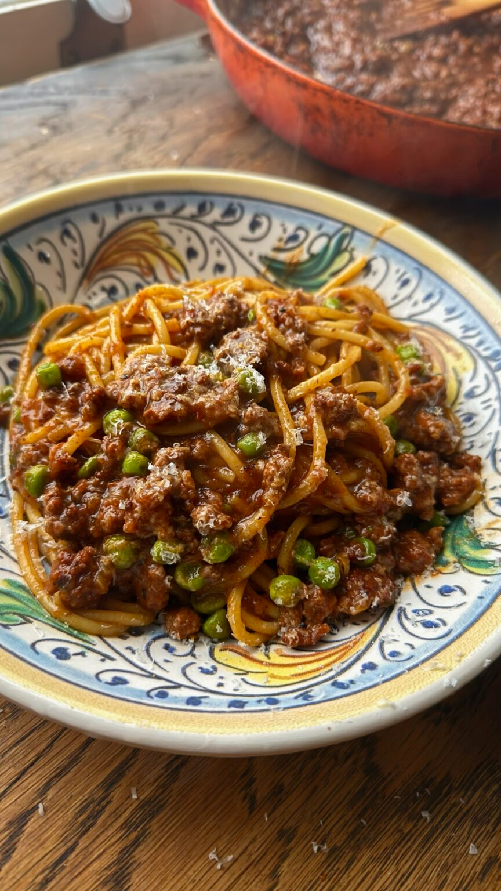

{ .recipe-img }

!!! abstract "Ingredients"
    - 500g lamb mince  
    - 1 large onion  
    - 5 cloves garlic  
    - 5 finger chillies  
    - 4cm knob ginger  
    - 1 tbsp tomato paste  
    - 200ml red wine or 1 red wine stock cube  
    - 1 tin tomatoes  
    - 1 tsp chilli powder  
    - 1 tsp ground cumin  
    - 1 tsp ground coriander  
    - ¼ tsp turmeric (optional)  
    - 200g frozen peas  

!!! tip "Utensils"
    - Slow cooker (or large pot / pressure cooker)  
    - Frying pan (if slow cooker has no sauté setting)  
    - Pestle and mortar  
    - Knife and chopping board  
    - Wooden spoon  

!!! info "Information"
    **Cost:** $$  
    **Preparation time:** 6 hours 30 minutes (slow cooker)  
    **Yield:** 6 servings (300g each)  

## Preparation Method

1. Set your slow cooker to the sauté setting (or use a frying pan if your slow cooker doesn’t have this function). Add the lamb mince and cook until browned, breaking it up with a wooden spoon.  
2. While the meat is browning, bash the garlic, chillies, and ginger together in a pestle and mortar until you have a rough paste.  
3. Once the lamb is browned, add the onion and the garlic-chilli-ginger paste, stirring well to combine. Cook for 5 minutes, then mix in the tomato paste and let it cook for another 3–4 minutes until it becomes rich and caramelized.  
4. Add in the red wine and deglaze the pan (or add the red wine stock cube with 200ml of water).  
5. Pour in the canned tomatoes and stir in the chili powder, ground cumin, ground coriander, and turmeric (if using). Mix well, ensuring everything is combined, then season with salt to taste.  
6. Set the