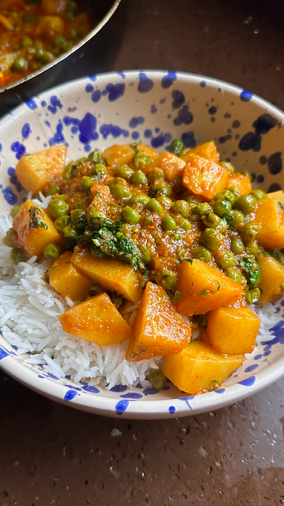

{ .recipe-img }

!!! abstract "Ingredients"
    - 500g potatoes  
    - 7 cloves garlic  
    - 3 inches ginger  
    - 200g tinned tomato  
    - ½ tsp cumin seeds  
    - 200g peas  
    - 2 tsp chilli powder  
    - 1 tsp ground cumin  
    - 1 tsp ground coriander  
    - ¼ tsp turmeric  
    - 1 tsp salt  
    - Small handful coriander  

!!! tip "Utensils"
    - Blender  
    - Large pan  
    - Knife and chopping board  
    - Wooden spoon  

!!! info "Information"
    **Cost:** $  
    **Preparation time:** 30 minutes  
    **Yield:** 4 servings (250g each)  

## Preparation Method

1. Peel the potatoes and dice them into bite-sized chunks.  
2. In the meantime, blend the ginger, garlic, and canned tomatoes until smooth.  
3. Heat a pan with a generous splash of oil and add the cumin seeds. When they begin to sizzle, stir in the blended tomato mixture.  
4. Stir in the chilli powder, cumin, coriander, turmeric, and salt, mixing thoroughly to combine.  
5. Add the diced potatoes to the pan, along with 250ml of water. Let it simmer for 15–20 minutes, or until the sauce thickens and the potatoes are tender.  
6. Stir in the peas, then gently mash some of the potatoes against the side of the pan to help thicken the curry. Let it cook for an additional 5 minutes.  
7. Finish by garnishing with chopped coriander and serve.  