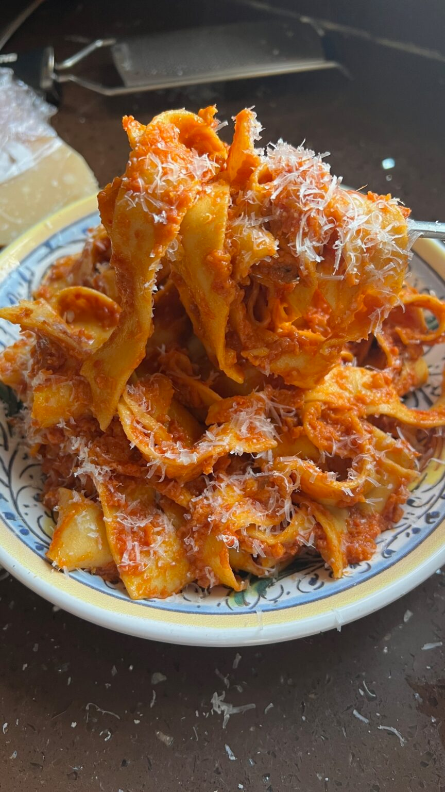

{ .recipe-img }

!!! abstract "Ingredients"
    - 2 kg tomatoes  
    - 2 shallots  
    - 10 garlic cloves  
    - 3 red chilli  
    - 250ml extra virgin olive oil  
    - 2 tbsp vegan cream cheese  
    - ½ bunch basil  
    - 2 aubergines  
    - 500g pappardelle  
    - 2 tbsp vegan parmesan  

!!! tip "Utensils"
    - Blender  
    - Oven and baking trays  
    - Large pot  
    - Pan  
    - Knife and chopping board  
    - Wooden spoon  

!!! info "Information"
    **Cost:** $$$  
    **Preparation time:** 2 hours  
    **Yield:** 6 servings (250g each)  

## Preparation Method

1. Preheat the oven to 170°C.  
2. Blend the tomatoes, shallots, garlic, red chili, and olive oil together.  
3. Spread the mixture across 2 to 3 baking trays and roast for 1 hour and 30 minutes, or until it thickens and caramelizes.  
4. Roast the aubergines directly on a gas flame for 15 minutes, until they’re deeply charred and soft inside. Once done, wash off the charred skin and chop the flesh into a minced texture.  
5. Cook the pappardelle in a large pot of boiling, heavily salted water.  
6. Once the tomatoes are roasted, transfer them to a pan with the aubergine, 200ml of pasta water, basil, and cream cheese. Bring to a simmer, then add the cooked pasta. Toss everything together and season with salt and pepper to taste.  
7. Top with parmesan and enjoy!  
