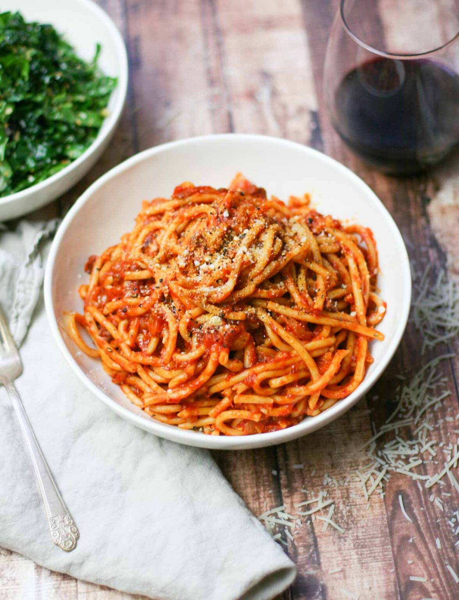

{ .recipe-img }

!!! abstract "Ingredients"
    - 1 tbsp olive oil  
    - 8 oz diced pancetta  
    - 1 yellow onion, minced  
    - 3 cloves garlic, minced  
    - ½ tsp crushed red pepper flakes  
    - 1 small bottle chardonnay (187 ml)  
    - 1 can (28 oz) crushed tomatoes (preferably Cento brand)  
    - 1 bay leaf  
    - 1 tsp kosher salt  
    - 1 tsp ground black pepper  
    - 1 lb dried bucatini pasta  
    - 1 cup grated Romano cheese (for serving)  
    - ½ cup minced parsley (for serving)  

!!! tip "Utensils"
    - Large sauté pan  
    - Wooden spoon  
    - Large pot for pasta  
    - Slotted spoon  
    - Knife and chopping board  

!!! info "Information"
    **Cost:** $$$  
    **Preparation time:** 1 hour  
    **Yield:** 6 servings (300g each)  

## Preparation Method

1. Heat olive oil in a large sauté pan over medium-high heat. Add pancetta and cook for ~6 minutes until golden brown. Remove pancetta with a slotted spoon and set aside.  
2. In the same pan, sauté onion, garlic, and red pepper flakes for ~6 minutes until softened and slightly golden. Adjust heat if garlic cooks too quickly.  
3. Add chardonnay and cook for 2 minutes to reduce.  
4. Return pancetta and juices to the pan, stirring to combine.  
5. Stir in crushed tomatoes, bay leaf, salt, and pepper. Bring to a boil, then reduce to a simmer. Cover and cook for 30 minutes, stirring every 5 minutes.  
6. Meanwhile, cook bucatini in salted boiling water until al dente (about 9 minutes). Reserve 1 cup of pasta water, then drain.  
7. Add pasta to the sauce and toss to coat. Stir in ½ cup reserved pasta water and cook over medium heat for a few more minutes until the sauce thickens and coats the noodles.  
8. Serve topped generously with Romano cheese, fresh parsley, and extra black pepper.  