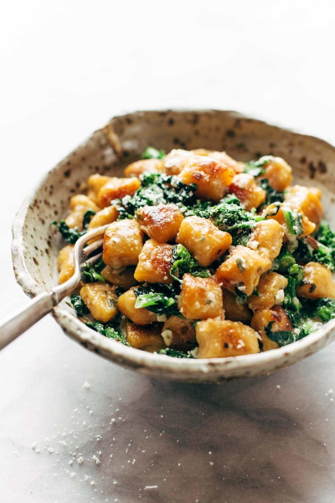

{ .recipe-img }

!!! abstract "Ingredients"
    **Gnocchi:**  
    - 1 sweet potato (about 1 lb)  
    - 1 cup whole milk ricotta cheese  
    - ¼ cup Parmesan cheese  
    - 1 ½ tsp salt  
    - 1 ¼ cup flour (plus more for dusting)  

    **Sauce (optional with broccoli rabe):**  
    - 5 cups finely chopped broccoli rabe (stems, leaves, florets)  
    - 8 tbsp butter  
    - ⅓ cup heavy cream  
    - 2 cloves garlic, minced  
    - 5–6 sage leaves  
    - 1 tsp sea salt  
    - ¼ cup Parmesan cheese  

!!! tip "Utensils"
    - Large pot  
    - Mixing bowl  
    - Skillet  
    - Knife and chopping board  
    - Wooden spoon  
    - Fork  

!!! info "Information"
    **Cost:** $$  
    **Preparation time:** 45 minutes (1h 30min if baking the potato)  
    **Yield:** 4 servings (250g each)  

## Preparation Method

1. **Cook the sweet potato:** Pierce the sweet potato with a fork, wrap in a damp paper towel, and microwave until soft (about 7 minutes). Alternatively, bake for about 1 hour.  
2. **Make the dough:** Scoop out the flesh and place in a mixing bowl. Add ricotta, Parmesan, and salt, mixing until smooth. Gradually add flour ½ cup at a time, kneading gently until a soft dough forms (do not over-knead).  
3. **Shape the gnocchi:** Transfer the dough to a floured surface, shape into a loaf (9×5 inches), and slice pieces. Roll each piece into a rope and cut into 1-inch segments. Transfer to a bowl.  
4. **Cook the gnocchi:** Bring a large pot of salted water to boil. Add the gnocchi and cook until they rise to the surface. Drain and toss with a little olive oil to prevent sticking. Reserve.  
5. **Optional broccoli rabe:** Blanch the broccoli rabe in boiling water for 1 minute, then transfer to ice water. Drain and set aside.  
6. **Pan-fry and finish:** Heat butter in a skillet until foamy. Add gnocchi and fry until golden brown (work in batches if needed). Add broccoli rabe (if using), garlic, sage, and salt. Cook for a few minutes. Remove from heat, stir in cream and Parmesan, and toss gently until lightly coated.  
7. Serve hot, seasoned with extra salt, pepper, and lemon juice if desired.  