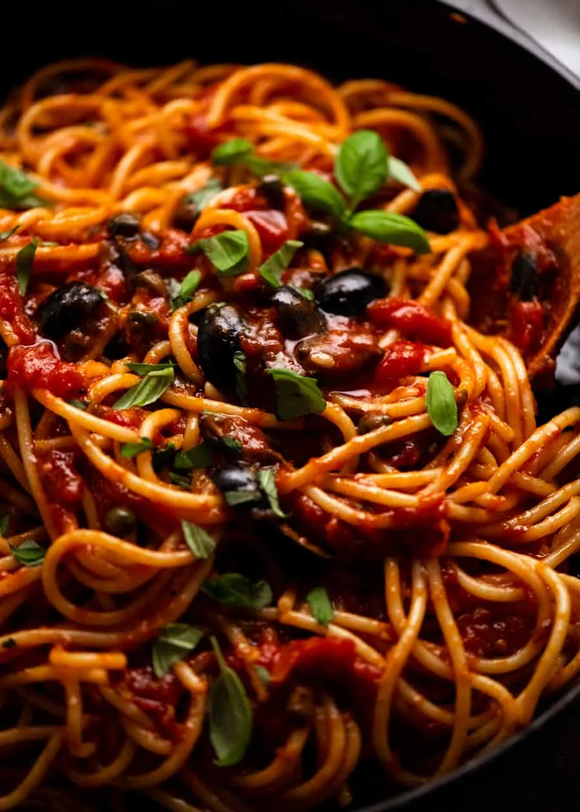

{ .recipe-img }

!!! abstract "Ingredients"
    - 200 g (7 oz) spaghetti or other long pasta  
    - 2 tbsp extra virgin olive oil (plus more for drizzling)  
    - 2 garlic cloves, finely minced  
    - 3 anchovy fillets, finely minced  
    - ¼ cup pitted black olives (preferably in oil), quartered  
    - 1 tbsp capers, drained  
    - ¼ tsp chilli flakes (red pepper flakes)  
    - 1 can (400 g / 14 oz) crushed tomato (or hand-crushed whole canned tomatoes)  
    - ½ cup water  
    - 1 tsp fresh oregano, chopped (or ¼ tsp dried)  
    - ⅛ tsp kosher salt (or 2 pinches table salt)  
    - ⅛ tsp black pepper  
    - ¼ tsp sugar (optional, adjust to tomato quality)  
    - 2 tbsp fresh basil, roughly chopped  

!!! tip "Utensils"
    - Large pot  
    - Medium skillet  
    - Wooden spoons  
    - Knife and chopping board  
    - Colander  

!!! info "Information"
    **Cost:** $$  
    **Preparation time:** 30 minutes  
    **Yield:** 4 servings (250g each)  

## Preparation Method

1. **Prepare:** Bring a large pot of water to a boil for the pasta. Warm serving bowls.  
2. **Cook garlic:** Heat olive oil in a skillet over medium-high heat. Add garlic and cook for ~15 seconds until golden.  
3. **Cook anchovies:** Add anchovies, capers, olives, and chilli flakes. Cook for 1 minute.  
4. **Make sauce:** Add tomatoes, rinsing the can with ½ cup water and adding that as well. Stir in oregano, salt, and pepper. Simmer on low for 10 minutes until sauce thickens.  
5. **Cook pasta:** Add 2 tsp salt to the boiling water. Cook spaghetti per package directions.  
6. **Reserve water:** Before draining, scoop out 1 mug of pasta cooking water. Drain pasta.  
7. **Combine:** Add pasta to the skillet with the sauce. Add ¼ cup pasta water and toss with 2 wooden spoons over low heat for 1 minute until sauce clings to pasta. Add more water if too dry.  
8. **Serve:** Transfer to warmed bowls. Drizzle with olive oil and sprinkle with basil. Serve immediately.  
