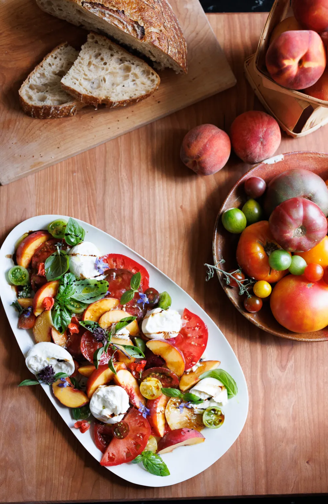

{ .recipe-img }

!!! abstract "Ingredients"
    - 3 large heirloom tomatoes, sliced  
    - Handful of cherry tomatoes, cut in half  
    - 2 peaches, sliced  
    - 3 large balls of burrata, buffalo mozzarella, or fresh mozzarella, sliced or torn into chunks  
    - Several fresh basil leaves  
    - Olive oil, to drizzle  
    - Aged balsamic vinegar, to drizzle  
    - Sea salt, to taste  
    - Freshly ground black pepper, to taste  

!!! tip "Utensils"
    - Knife and chopping board  
    - Salad bowl or serving plate  

!!! info "Information"
    **Cost:** $$  
    **Preparation time:** 15 minutes  
    **Yield:** 4 servings (250g each)  

## Preparation Method

1. Slice the heirloom tomatoes and halve the cherry tomatoes.  
2. Slice the peaches.  
3. Place the tomatoes and peaches on a serving plate.  
4. Tear or slice the burrata/mozzarella and arrange on top.  
5. Scatter fresh basil leaves over the salad.  
6. Drizzle with olive oil and aged balsamic vinegar.  
7. Season with sea salt and freshly ground black pepper. Serve immediately.  