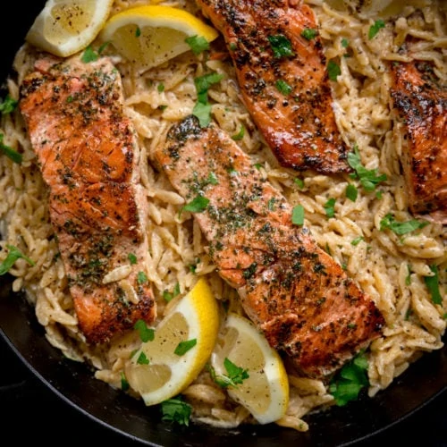

{ .recipe-img }

!!! abstract "Ingredients"
    **Salmon:**  
    - 4 salmon fillets  
    - Pinch of salt  
    - Pinch of garlic salt  
    - ¼ tsp black pepper  
    - ⅛ tsp paprika  
    - ½ tsp dried parsley  

    **Orzo:**  
    - 2 tbsp olive oil  
    - 2 tbsp unsalted butter  
    - 2 cloves garlic, minced  
    - 230 g (1 cup + 2 tbsp) dried orzo  
    - 480 ml (2 cups) chicken stock  
    - 60 ml (¼ cup) heavy cream  
    - 75 g (¾ cup) grated parmesan  
    - Zest and juice of ½ lemon  
    - ¼ tsp salt  
    - ½ tsp black pepper  

    **To serve:**  
    - Fresh parsley, chopped  
    - Lemon wedges  
    - Black pepper  

!!! tip "Utensils"
    - Large frying pan (skillet)  
    - Knife and chopping board  
    - Wooden spoon  
    - Tongs  

!!! info "Information"
    **Cost:** $$$  
    **Preparation time:** 35 minutes  
    **Yield:** 4 servings (300g each)  

## Preparation Method

1. **Season salmon:** Place the salmon fillets on a plate. Mix together salt, garlic salt, pepper, paprika, and dried parsley. Sprinkle on top of the salmon and press gently.  
2. **Cook salmon:** Heat olive oil and butter in a large frying pan over medium-high heat. Add the salmon fillets skin-side-up and cook 3–4 minutes until golden. Remove to a plate, skin-side-down.  
3. **Cook garlic and orzo:** Reduce heat to medium, add garlic, and cook 30 seconds. Add orzo, stir, then add chicken stock. Bring to a boil, then reduce heat and simmer 8–9 minutes, stirring occasionally, until al dente. Use tongs to move the salmon and stir the orzo underneath to prevent sticking.  
4. **Finish orzo:** Stir in cream, parmesan, lemon zest, lemon juice, salt, and pepper.  
5. **Serve:** Turn off heat, sprinkle parsley and black pepper, arrange lemon wedges in the pan, and serve hot.  
