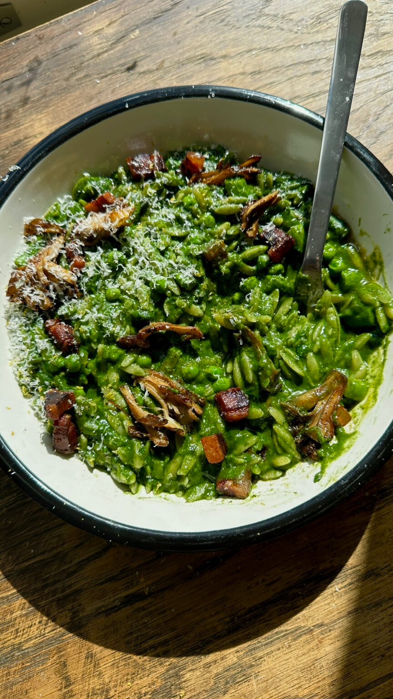

{ .recipe-img }

!!! abstract "Ingredients"
    - 1 tbsp butter  
    - 1 leek, roughly chopped  
    - 4 cloves garlic, roughly chopped  
    - 150g spinach  
    - Large handful basil  
    - 500ml chicken stock  
    - 250g orzo  
    - 100g asparagus, chopped  
    - 50g frozen peas  
    - 50g pancetta, cubed  
    - 100g mushrooms  
    - 1 tsp chilli flakes  
    - 1 egg yolk (optional)  
    - Parmesan to serve  

!!! tip "Utensils"
    - Large pot  
    - Frying pan  
    - Hand blender  
    - Knife and chopping board  
    - Wooden spoon  

!!! info "Information"
    **Cost:** $$  
    **Preparation time:** 30 minutes  
    **Yield:** 4 servings (250g each)  

## Preparation Method

1. Sauté the leeks and garlic in butter for about 3 minutes, or until softened.  
2. Stir in the spinach, basil, 100ml of chicken stock, and ½ teaspoon of salt.  
3. Let the spinach cook down, then blend it with the remaining chicken stock using a hand blender until smooth.  
4. Stir in the orzo and cook over medium heat for 6 minutes, until it’s nearly cooked through.  
5. Add the asparagus and peas to the pot, stirring well, and continue cooking for another 3 minutes, or until the vegetables and orzo are fully cooked. Meanwhile, place the pancetta in a cold pan and set it over medium-high heat. Cook for about 5 minutes, allowing the fat to render and the pancetta to become crispy.  
6. Transfer the pancetta to a plate, then add the chilli flakes and mushrooms to the pan. Cook the mushrooms for 5 minutes, or until they turn crispy.  
7. Serve topped with an egg yolk, crispy pancetta, mushrooms, and a sprinkle of Parmesan. 