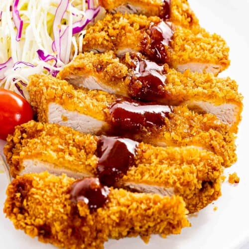

{ .recipe-img }

!!! abstract "Ingredients"
    **Pork:**  
    - 2 slices boneless pork loins or chops, pounded to ¾ inch thick (~5 oz each)  
    - 1 cup Japanese panko bread crumbs  
    - ½ cup all-purpose flour  
    - 1 egg, beaten  
    - Salt & pepper  
    - Vegetable oil, for frying  

    **Tonkatsu Sauce:**  
    - 4 tbsp ketchup  
    - 2 ½ tbsp Worcestershire sauce  
    - 1 tbsp soy sauce  
    - ⅛ tsp garlic and onion powder  
    - 1 ½ tsp sugar (optional)  

!!! tip "Utensils"
    - Frying pan or deep fryer  
    - Shallow bowls for coating  
    - Knife and chopping board  
    - Small mixing bowl  

!!! info "Information"
    **Cost:** $$  
    **Preparation time:** 40 minutes (+ marinating if desired)  
    **Yield:** 2 servings (250g each)  

## Preparation Method

1. **Tonkatsu sauce:** Mix ketchup, Worcestershire, soy sauce, garlic/onion powder, and sugar (optional). Set aside.  
2. **Prepare pork:** Make small cuts along the connective tissue to prevent curling. Pound to ¾ inch thickness.  
3. **Bread the pork:** Season with salt and pepper. Dredge in flour, dip in beaten egg, then coat in panko crumbs.  
4. **Fry:** Heat oil to 340°F (170°C). Fry pork cutlets 5–6 minutes per side until golden and cooked through. Skim excess crumbs to maintain oil.  
5. Serve hot with tonkatsu sauce.  
