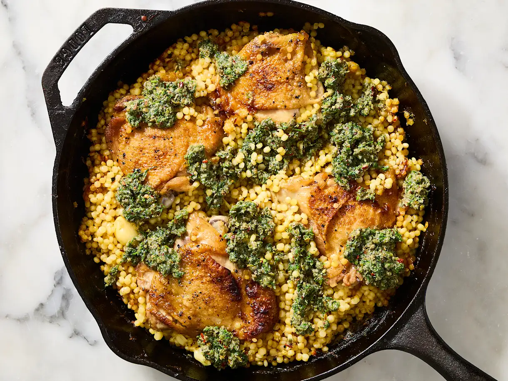

{ .recipe-img }

!!! abstract "Ingredients"
    **Garlic Chicken & Couscous:**  
    - 4–6 bone-in, skin-on chicken thighs (1 ½ to 2 lbs total)  
    - Kosher salt and freshly ground black pepper  
    - 3 tbsp neutral oil (sunflower or grape seed)  
    - 2 medium shallots, finely sliced  
    - 1 ½ cups pearled (Israeli) couscous or orzo  
    - 3 cups water  
    - 15 garlic cloves, lightly crushed and peeled  
    - 1 chicken bouillon cube (or 2 tsp bouillon powder)  

    **Dill Topping:**  
    - ⅓ cup fresh dill, chopped  
    - ⅓ cup brined capers, drained, rinsed, and finely chopped  
    - 3 tbsp extra virgin olive oil  
    - 2 tbsp rice vinegar or apple cider vinegar  
    - 3 garlic cloves, finely minced or grated  
    - 1 tsp red chili flakes (plus more to taste)  
    - Kosher salt and freshly ground black pepper, to taste  

!!! tip "Utensils"
    - 12-inch cast-iron or ovenproof skillet  
    - Mixing bowls  
    - Aluminum foil  
    - Oven and broiler  

!!! info "Information"
    **Cost:** $$$  
    **Preparation time:** 1 hour  
    **Yield:** 4 servings (350g each)  

## Preparation Method

1. **Prep chicken:** Preheat oven to 425°F (220°C). Pat chicken thighs dry with paper towels. Season generously with salt and pepper.  
2. **Sear chicken:** Heat 1 tbsp oil in a skillet over medium. Place chicken skin-side down, cook 6–8 minutes until skin is crisp and golden. Flip and cook 4–5 minutes. Transfer to a plate.  
3. **Cook couscous base:** Add remaining 2 tbsp oil to pan with shallots. Cook 2 minutes. Stir in couscous and cook 4–5 minutes until toasty. Add water, garlic, bouillon, and a pinch of salt. Place chicken thighs on top, skin-side up. Bring to a simmer, then remove from heat.  
4. **Bake:** Cover tightly with foil and bake 30–35 minutes until most liquid is absorbed.  
5. **Prepare dill topping:** Mix dill, capers, olive oil, vinegar, garlic, chili flakes, salt, and pepper in a bowl.  
6. **Finish chicken:** Remove foil and bake 5 minutes more. Preheat broiler and crisp chicken skin under broiler for 2–3 minutes.  
7. **Serve:** Mash softened garlic cloves over chicken. Spoon dill topping across chicken and couscous. Serve immediately.  