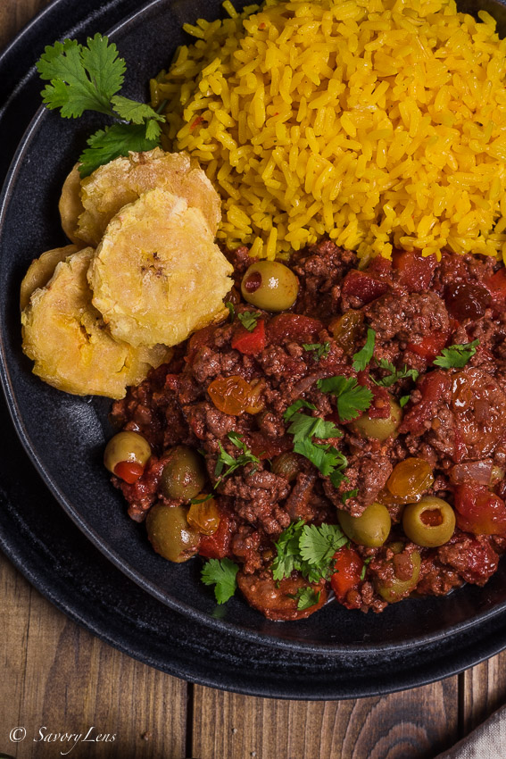

{ .recipe-img }

!!! abstract "Ingredients"
    - 2 tomatoes, diced  
    - 1 tbsp neutral oil  
    - ½ large onion, diced  
    - 5–6 garlic cloves, minced  
    - 1 lb ground beef  
    - ¼ tsp ground pepper  
    - ½ tbsp tomato paste  
    - 3–4 cloves  
    - 1–2 russet potatoes, diced  
    - 1–2 carrots, diced  
    - 2 cups chicken broth  
    - ⅛ cup jalapeño brine  
    - 2–3 pickled jalapeños, diced  
    - 2–3 bay leaves  

!!! tip "Utensils"
    - Large skillet  
    - Wooden spoon  
    - Knife and chopping board  
    - Measuring cups and spoons  

!!! info "Information"
    **Cost:** $$  
    **Preparation time:** 50 minutes  
    **Yield:** 6 servings (8 oz each)  

## Preparation Method

1. Heat oil over medium heat in a large skillet. Add tomatoes and onions, cooking for ~5 minutes until soft.  
2. Stir in garlic and cook until fragrant. Season with a pinch of salt.  
3. Push vegetables to the sides, add ground beef to the center, and let sear before breaking apart.  
4. Once nearly cooked, season with ½ tsp salt, pepper, cloves, diced jalapeños, and jalapeño brine. Stir well.  
5. After a few minutes, add carrots, potatoes, and tomato paste. Cook 3–4 minutes to blend flavors.  
6. Pour in chicken broth and add bay leaves with a pinch of salt. Bring to a simmer.  
7. Cover, reduce heat to medium-low, and cook 20–25 minutes until potatoes are tender. Adjust seasoning as needed.  
8. Serve hot with tostadas or rice. Top with queso fresco if desired.  