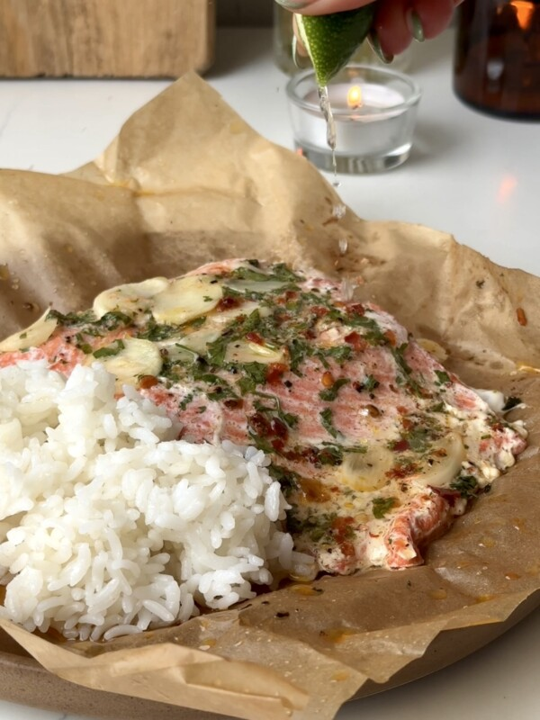

{ .recipe-img }

!!! abstract "Ingredients"
    - 2 tbsp softened butter  
    - 1 tbsp chopped cilantro  
    - Juice and zest of 1 lime  
    - 5–6 garlic cloves, thinly sliced  
    - Salt and pepper, to taste  
    - ½–1 tsp red chili flakes (optional)  
    - 1 lb skinless salmon, cut into 2 portions  

!!! tip "Utensils"
    - Small mixing bowl  
    - Baking sheet  
    - Parchment paper  
    - Knife and chopping board  

!!! info "Information"
    **Cost:** $$$  
    **Preparation time:** 30 minutes  
    **Yield:** 2 servings (250g each)  

## Preparation Method

1. Preheat oven to 400°F (200°C).  
2. In a bowl, mix softened butter, cilantro, lime zest, garlic slices, salt, pepper, and chili flakes (if using) into a garlic butter paste.  
3. Cut two large sheets of parchment paper. Place one salmon fillet in the center of each sheet.  
4. Spread the garlic butter paste evenly over each fillet.  
5. Squeeze lime juice over the top.  
6. Fold parchment over the fillets and crimp edges to seal into packets.  
7. Place packets on a baking sheet and bake for 10 minutes.  
8. Turn off oven and let salmon rest inside for an additional 5–10 minutes, depending on fillet thickness.  
9. Carefully open packets and serve hot with rice and/or vegetables.  
