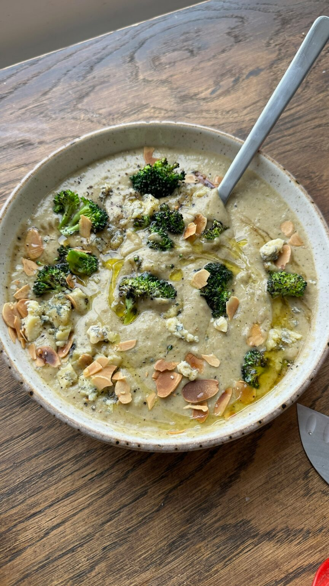

{ .recipe-img }

!!! abstract "Ingredients"
    - 1 head broccoli  
    - 2 small onions, roughly chopped  
    - 6 cloves garlic, roughly chopped  
    - 1 celery, roughly chopped  
    - 150g potatoes, roughly chopped  
    - 400g white beans  
    - 1 tbsp sherry vinegar  
    - 150g stilton  

!!! tip "Utensils"
    - Grill pan or skillet  
    - Large pot  
    - Knife and chopping board  
    - Hand blender  
    - Wooden spoon  

!!! info "Information"
    **Cost:** $$  
    **Preparation time:** 30 minutes  
    **Yield:** 4 servings (300ml each)  

## Preparation Method

1. Cut the broccoli into florets and cook in a hot pan with olive oil or on a grill until lightly charred.  
2. Sauté the onion, garlic, and celery for 5 minutes. Deglaze the pan with sherry vinegar, then add the potatoes and enough water to cover.  
3. Let the mixture simmer for 10 minutes, then add the broccoli florets, any leftover broccoli pieces, and the beans. Cook for another 5–10 minutes until the broccoli is fork-tender.  
4. Blend the soup using a hand blender, then crumble in the blue cheese and stir until melted.  
5. Season with salt and pepper, then serve with buttered bread and toasted almonds.